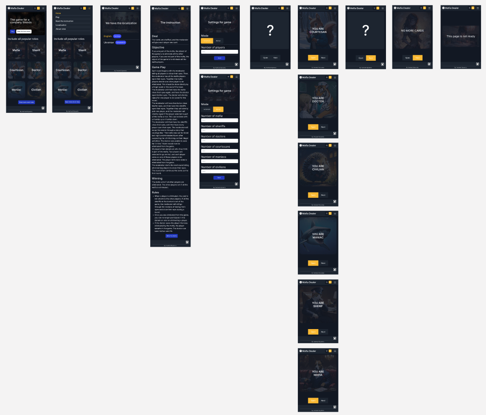
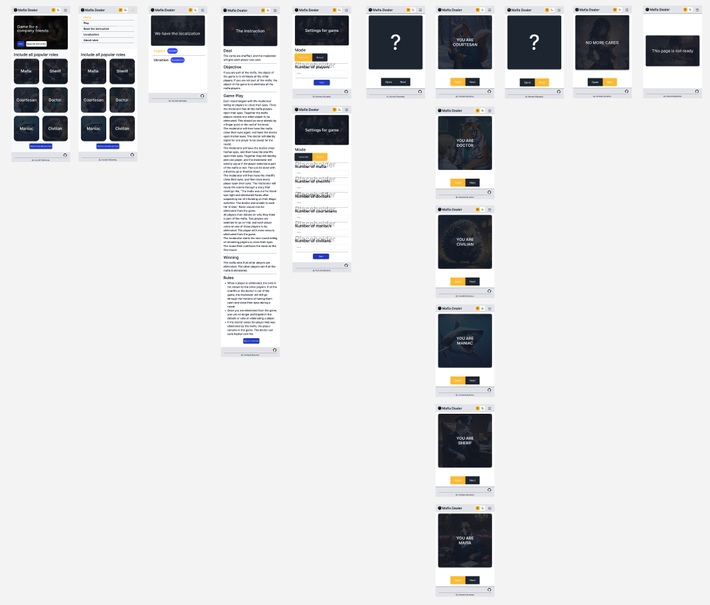
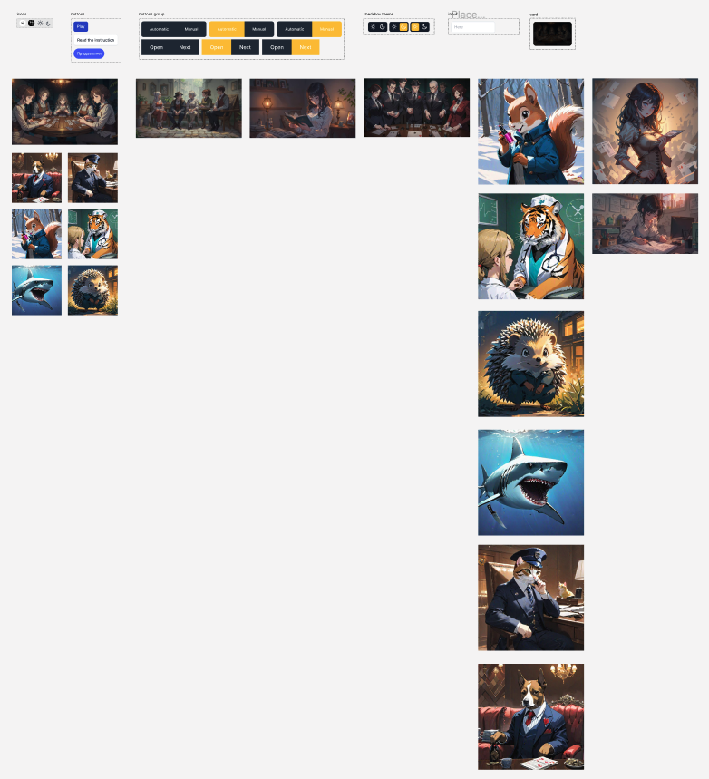

# Mafia Dealer

## About

This is an app for playing mafia without cards for a group of friends

## Technology used:

- TypeScript
- React / NextJS
- Prettier
- Eslint
- Tailwind CSS
- i18n
- Service worker (PWA)

## Additionally:

- Mobile First
- Design (Figma)
- CI/CD
- Deploy (Vercel)
- Theme tailwind (Dark and Light)

## Dark theme



## Light theme



## UI Kit



> ### If you want to see the :
>- [Template](https://www.figma.com/file/bC4lfzYbSWxkvdCXuXkhlr/Untitled?type=design&node-id=16%3A2&mode=design&t=jqVnnxeEK8m47ntR-1)
>- [Deploy](https://mafia-dealer-noc1ipzl9-yevheniy2020.vercel.app/uk)

## Getting Started

First, run the development server:

```bash
npm run dev
# or
yarn dev
# or
pnpm dev
# or
bun dev
```

Open [http://localhost:3000](http://localhost:3000) with your browser to see the result.

You can start editing the page by modifying `app/page.tsx`. The page auto-updates as you edit the file.

This project uses [`next/font`](https://nextjs.org/docs/basic-features/font-optimization) to automatically optimize and
load Inter, a custom Google Font.


